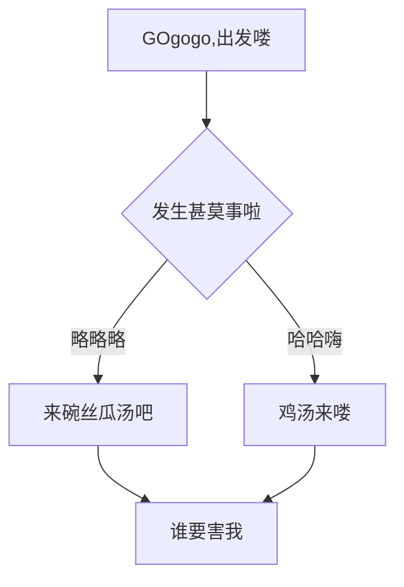

### <center><font face="仿宋" color=orange>SynX招新 基础类题目</font></center>  
---  
#### 目录   
[Git](#第一题)  -----Git-代码仓库地址(在分支AB中):[Git题目相关代码仓库][Git]  
[Markdown](#第二题)  
[VS code](#第三题)  
[C语言](#第四题)-----C语言-代码仓库地址(在分支C中):[C语言题目代码仓库][C]

---  
#### 第一题  
### Git  
##### 1. Git初识   
- 本人这里选择的是使用vscode中自带的git工具进行git的学习和使用,如果完成招新题后还有剩余时间,将回过头来学习Linux基础命令行和git的命令行操作.   
  
- 参考教程:   
  [给傻子的git教程](https://www.bilibili.com/video/BV1Hkr7YYEh8?spm_id_from=333.788.videopod.sections&vd_source=b89c3413e127c62f754fdd601b300cee "嘿嘿嘿")  
  [vscode+git基础教程](https://www.bilibili.com/video/BV1ua41167Ma?vd_source=b89c3413e127c62f754fdd601b300cee&p=9&spm_id_from=333.788.videopod.episodes "这个语法真补戳")  
  [vscode+git](https://www.bilibili.com/video/BV1w14y1C7oi?vd_source=b89c3413e127c62f754fdd601b300cee&spm_id_from=333.788.videopod.sections "肯定每人看见")   
##### 2.关于Git的问题  
- 我理解的Git含义(可能有不准确的地方,请各位大佬批评指正) 
 
>  Git最早是为Linux内核开发而设计的分布式版本管理系统.
> 
> 假如你在写一个很长很复杂的程序，突然灵光乍现想要尝试一个新的功能，经过费劲的改动和调试，你发现自己之前的灵光一闪并不实用，此时你必然想要把程序改回初版，面对着被修改的千疮百孔的程序，如果你在每一步修改时都保存了副本，那么还有挽回的机会，如果没有存档意识，那么只能对着改后的代码欲哭无泪．就在此时Git闪亮登场，不仅可以随时存档，还可以将本地仓库直接推送到远程仓库上，最重要的是一键就可使代码恢复原状．  
> 
> 当然Git在多人开发中的作用也是大大滴有，小组成员经过不同的修改后，只需全员都同步一下,所有人就可以清晰地看见他人的改动啦．　　
  
- 我理解的Git的优缺点：  
   - 首先是优点:  
  免费(free最棒!),开源  
  灵活便捷  
  分布式安全可靠  
  支持多分支,使程序员能够大胆地实践新想法 
  - 然后是缺点:  
  使用有壁垒,感觉对新手而言不太容易上手(如果使用命令行还要先去了解Linux指令,雪上加霜)  
  命令行有点多,不容易记忆  
  对视频,图片之类的不太友好  
  
##### 3.Git实践  
> 这些代码全是ChatGpt写的,能力不足实在惭愧:cry:   
 
代码仓库地址(在分支AB中):[Git题目相关代码仓库][Git]   

-----    
#### 第二题   
### Markdown  
以下是对题目中功能的实现 ~~(终于到我最擅长的部分了)~~:   
### 芙芙我永远喜欢你   
---  
> <font color=brown>寄予纸鸢送愁客,天涯犹有未归人.</font>  
> 我一直相信我们能够再次相见
>
>    - ~~愿风神忽悠你~~  
>    - 相信分别的日子总会迎来终结  

>去追寻便好，哪怕是须臾的光亮．　　　　　　
>>欲买桂花同载酒,只可惜故人,何日再见呢?  

print("BiliBili,干杯~")  




---  
#### 第三题  
### VS code  
配图如下:  
  
- tasks配置  
    
- launch配置  
    
----  
#### 第四题  
### C语言   
以下所有代码都在这里:代码仓库地址(在分支C中):[C语言题目代码仓库][C]　　

#####　１.ASCII码  
1. 问题一  
   ```c  
   #include <stdio.h>
   
   int main(){
       char a = 'a';
       printf("%d",a);
       return 0;
   }  
   ```  
- 输出值为:97.  
- 原因:`a='a'`表示在a中储存着`'a'`的ASCII值,而`%d`用于打印int类,这里使用`%d`会将`char`类转换为`int`类,从而打印`'a'`的ASCII值97.  
2. 问题二  
   解答如下:  
   ```c  
     #include <stdio.h>
      int main(){
       char a = '1';
       //预期输出结果 1
       //请在这里补全代码
       a=a-'0';
       //
       printf("%d",a);
       return 0;
      }
    ```    
      其中`'1'`表示`'1'`的ASCII值,而输出的1是十进制的整数1.  

##### 2. 数组  
1.  问题一   
   ```c  
  #include<stdio.h>
int main(){
    int s[5];    
    float sum=0;
    float a; 
    int i;     

    printf("请输入5个学生的成绩:\n");

    for(i=0;i<5;i++){
        printf("请输入第%d个学生的成绩:",i+1);
        scanf("%d",&s[i]);  
        sum=sum+s[i];
    }  
    
    a=sum/5;

    printf("平均成绩为:%.2f",a);

}  
```     
2. 问题二  
   - 再写这道题时遇到了点问题,我起初是这样写的:  
  ```c  
  int n;
    float sum=0;
    float a;  
    int i;  
    int s[n];
    
    printf("请输入学生人数:");  
    scanf("%d",&n);    
  ```  
  - 通过询问ChatGpt,发现问题出在这:  
  数组必须有确定的大小,所以应该先读入`n`,在进行数组声明.  
  - 以下是正确解答:  
  ```c
  #include<stdio.h>
  int main(){
    int n;
    float sum=0;
    float a; 
    int i;
    
    printf("请输入学生人数:");  
    scanf("%d",&n);  
    int s[n];
    printf("\n");
    printf("请输入%d个学生的成绩:\n\n",n);

    for(i=0;i<n;i++){
        printf("请输入第%d个学生的成绩:",i+1);  
        scanf("%d",&s[i]);    
        sum=sum+s[i];  
        printf("\n");
    }  
    
    a=sum/n;

    printf("平均成绩为:%.2f",a);

  }  
 ```
  
     
  
    
3. 问题三  
```c
#include<stdio.h>
int main(){
    int n;
    float sum=0;
    float a; 
    int i,j,k,q,t;
    
    printf("请输入学生人数:");  
    scanf("%d",&n);  
    int s[n];
    printf("\n");
    printf("请输入%d个学生的成绩:\n\n",n);

    for(i=0;i<n;i++){
        printf("请输入第%d个学生的成绩:",i+1);  
        scanf("%d",&s[i]);    
        sum=sum+s[i];  
        printf("\n");
    }  
    
    a=sum/n;

    printf("平均成绩为:%.2f\n\n",a);  
    printf("分数分布统计:\n");
    printf("分数     人数\n");
    printf("============\n");  

    for(i=0;i<n;i++){  
        for(q=0,t=0;q<i;q++){  
            if(i!=q && s[i]==s[q]){
                t++;
            }
        }
        if(t==0){
            for(j=0,k=0;j<n;j++){
                    if (s[i]==s[j]){
                        k++;
                    }
            }    
            printf("%02d    %d\n",s[i],k);   
        }  
    }   
```
  
     
##### 3.循环结构  
1. 问题一 ---- 阶乘:  
 ```c  
  #include<stdio.h>  

long N(int n);  
// 用于计算n的阶乘  

long N(int n){
    int i;
    long s=1;
    for(i=1;i<=n;i++){
        s=s*i;
    }
    return s;
}  

int main(){
    int n;

    printf("请输入一个非负整数:");
    scanf("%d",&n);
    printf("%d!=%d",n,N(n));

    return 0;
  }  
```
   
    
2. 问题二 ----斐波那契数列:  
```c  
#include<stdio.h>  

int F(int n);  
// 用于计算Fibonacci数列第n项的值  

int F(int n){
    if(n<=2){
        return 1;
    }
    else{
        return F(n-2)+F(n-1);
    }
}

int main(){
    int n=1;  
    int i=1;

    printf("请输入打印项数:") ; 
    scanf("%d",&n);

    while(i<=n){
        printf("%d ",F(i));
        i++;
    }
}  
```  
##### 4. 指针   
完成这部分题目时的参考:  
[这个视频](https://www.bilibili.com/video/BV1sU4y1K7jp/?vd_source=b89c3413e127c62f754fdd601b300cee "不知道写啥了")  
[还有这个视频](https://www.bilibili.com/video/BV1MH4y1u7uE/?spm_id_from=333.337.search-card.all.click&vd_source=b89c3413e127c62f754fdd601b300cee "那就随便来的吧")   
当然还有AI老师的帮助(只是问了知识点,绝对不抄袭).
1. 问题一   
```c  
#include <stdio.h>
   
int main() {
    int num = 10;
    int *ptr = &num; // 填空：将ptr指向num
       
    printf("num的值: %d\n",*ptr); // 填空：通过指针访问num的值
    printf("num的地址: %p\n",ptr); // 填空：通过指针获取num的地址
       
    *ptr = 20; // 通过指针修改num的值
    printf("修改后num的值: %d\n", num);
       
    return 0;
   }
```

 
2. 问题二   
```c  
#include <stdio.h>
   
int main() {
int arr[5] = {1, 2, 3, 4, 5};
int *ptr = arr; // 数组名就是数组首元素的地址
       
// 使用指针访问数组元素
for(int i = 0; i < 5; i++) {
    printf("arr[%d] = %d", i, *ptr); // 填空：通过指针访问数组元素
    printf(", 地址: %p\n", ptr); // 填空：获取每个元素的地址
    ptr++; // 指针移动到下一个元素
}
       
return 0;
}  
``` 
3. 问题三  
```c     
#include <stdio.h>
   
int main() {
    int arr[3] = {10, 20, 30};
    int *ptr = arr;
       
    printf("%d\n", *ptr);      // 输出:arr[0]的值--10
    printf("%d\n", *(ptr+1));  // 输出:arr[1]的值--20
    printf("%d\n", *ptr+1);    // 输出:arr[0]+1后的值--11
       
    ptr++;
    printf("%d\n", *ptr);      // 输出:arr[1]的值--20
       
    return 0;
}  
```  
4. 问题四  
```c    
#include<stdio.h>  

void swap(int *a,int *b){  
    int t;
    t=*a;  
    *a=*b;
    *b=t;
}

int main(){

    int a,b;  
    int *pa,*pb;  

    pa=&a;
    pb=&b;  
    
    printf("请输入a,b的值:");  
    scanf("%d%d",&a,&b);  
    printf("交换前,a=%d,b=%d\n",a,b);

    swap(pa,pb);   
    printf("交换后,a=%d,b=%d",a,b);  

    return 0;

}  
```  

最后谢谢SynX工作室的各位,真的通过基础部分学到很多.


   
   

    
  
　　　　

 


  
  
  
  
  [Git]:https://github.com/c-xixi/SynX-Recruit/tree/A "看不见我"  
  [C]:https://github.com/c-xixi/SynX-Recruit/tree/C "没想到还是有不会的"
　　 　　　

　　
   
  
    
